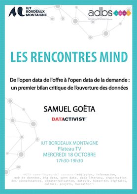

# De l'open data de l'offre à l'open data de la demande : un premier bilan critique de l’ouverture des données
**Mercredi 18 octobre 2017, 1re Rencontre MIND**

En décembre 2017, cela fera 10 ans que les principes de l’open data ont été formulés. Depuis, plus de 50 pays dans le monde ont adopté une politique d’open data et le mouvement ne cesse de s'étendre dans les collectivités locales, les institutions et les entreprises. La France est le premier pays à avoir inscrit dans la loi un engagement d’ouverture des données par défaut. Mais quel premier bilan peut-on tirer de ces dix années ?

Dans cette conférence, Samuel Goëta s’appuiera sur ses travaux en sociologie pour expliquer le travail invisible derrière l’ouverture des données. Impensé des politiques d’open data, ce travail est pourtant crucial pour s’assurer que les données trouvent un public. Pour replacer les usagers au cœur des politiques d’open data, Samuel présentera le projet DODOdata, porté par la coopérative Datactivist qu’il a co-fondé, qui vise à faciliter radicalement les Demandes d’Ouverture de DOnnées (DODO) et à obtenir les données que le public demande, comme il le demande.

Animation de la conférence par :
Olivier Le Deuff, Maître de conférences en sciences d l'information et de la communication - IUT Bordeaux Montaigne, laboratoire Mica.
Chloé Lalouette, étudiante dans la licence professionnelle Médiation de l’Information Numérique et de la Donnée (LP MIND).

Cette conférence est la première Rencontre MIND, un cycle organisé par les étudiant·e·s de la licence professionnelle MIND (Médiations de l'information numérique et des données) de l'IUT Bordeaux Montaigne.

Mercredi 18 octobre 2017 - 17h30 - 19h00
plateau TV de l’IUT Bordeaux Montaigne, 1 rue Jacques Ellul, Bordeaux
Entrée libre et gratuite
