class: center, middle

Cette présentation est en ligne et librement réutilisable : http://datactivi.st/ubordeaux/

Le contenu créé par Datactivist est placé sous la licence [Creative Commons CC-BY-SA ](https://creativecommons.org/licenses/by-sa/3.0/deed.fr). 

---
# Au programme
.pull-left[- La naissance de l’open data de l’offre

- Ouvrir des données : jetons un œil aux coulisses 

- Les limites de l’open data de l’offre

- La vision de Datactivist : vers un open data de la demande
]
.pull-right[
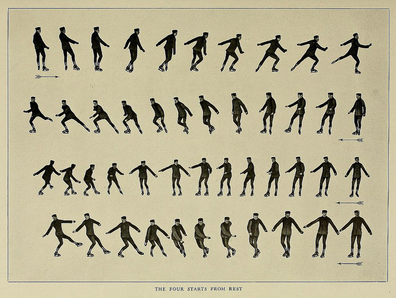
]
---
# Qui suis-je?
.pull-left[- Spécialiste de l’open data : j’ai cofondé [Datactivist](datactivi.st), une société coopérative qui a pour mission d’ouvrir des données et de les rendre utiles. 

- Militant de l’ouverture, j’ai co-fondé [Open Knowledge France](okfn.fr). 

- Chercheur sur l’open data, j’ai fait ma thèse de doctorat en sociologie ["Instaurer des données, instaurer des publics : une enquête sociologique dans les coulisses de l'open data"](https://pastel.archives-ouvertes.fr/tel-01458098) sur le sujet. 
]
.pull-right[

]
.footnote[(La [Public Domain Review](http://publicdomainreview.org/) est toujours là pour vous fournir des illustrations en cas de panne d'inspiration)]
---
class:inverse, center, middle
# Aux origines de l'open data "de l'offre"
### Retour sur quelques moments fondateurs

---
# Un cadre juridique ancien
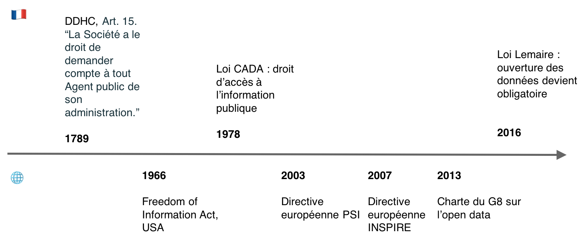
---
## 2005 : Open Definition, définir les droits de l'usager d'un savoir ouvert
.reduite[
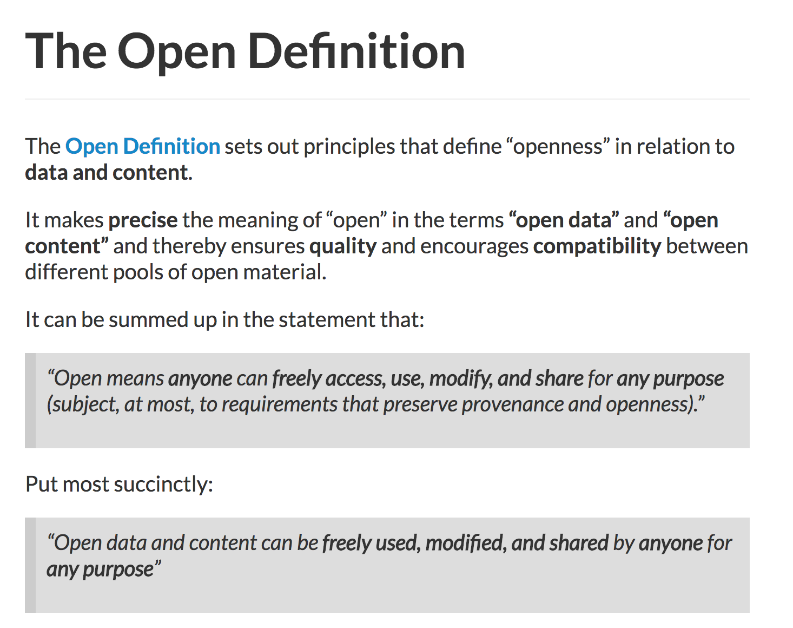
]
---
## 2007 : Sebastopol, la rencontre fondatrice de l'open data
.reduite[
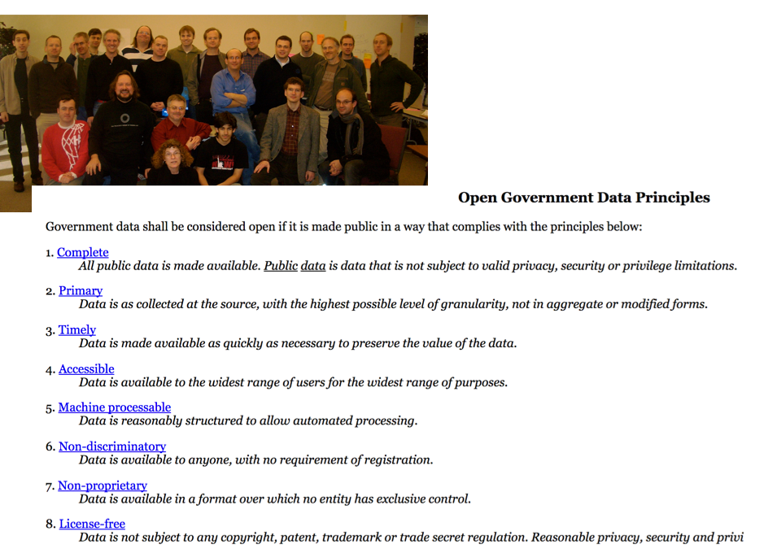
]
---
## 2008 : "Raw Data Now", obtenir les données brutes 
.reduite[

]
---
## 2008 : le modèle 5⭐, faciliter la lisibilité par les machines
.reduite[

]
---
# Des principes essentiellement techniques
Au départ, on ne s’intéresse pas au contenu des données et au projet politique de l’open data :

> « Il est facile d’imaginer qu’un régime fermé puisse libérer de grands volumes de données qui correspondent à ces huit principes [de Sebastopol] sans pour autant faire avancer d’aucune manière la redevabilité [*accountability*] du gouvernement. […] 

>La publication électroniques des déclarations de la Corée du Nord pourrait, par exemple, satisfaire ces huit critères. »

.footnote[Traduction personnelle depuis Yu & Robinson (2012). "The New Ambiguity of “Open Government”." *UCLA Law Review* 178: 178-208.]

Plusieurs instruments comme les classements et la charte internationale de l'open data ont tenté de corriger cela.
---
## 2010 : l'ère des classements, vérifier l'ouverture des données essentielles
.reduite[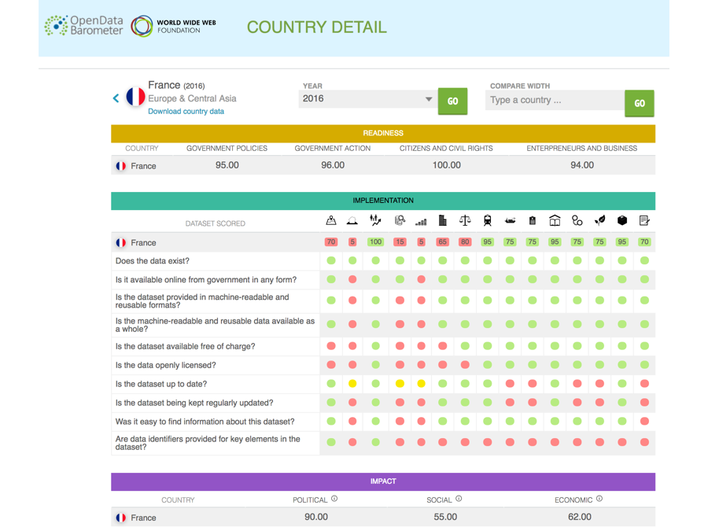]
---
## 2013 : la charte internationale, des objectifs politiques pour l'open data
.reduite[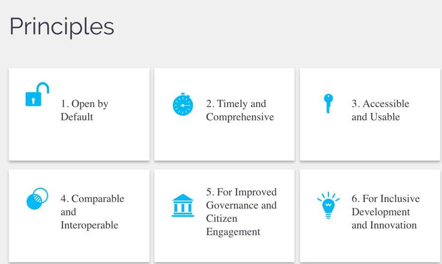]
---
# L'open data "de l'offre" ?
.pull-left[

## En théorie

### Toutes les données sont ouvertes sous leur forme brute dès leur production

]
.pull-right[

## En pratique

###L’administration choisit quelles données ouvrir, comment les ouvrir, quand et ce qu’elles contiennent

]
---
class:inverse, middle, center
# L’open data vu des coulisses de l’administration
## Un parcours fait de "frictions"
---
# Le travail invisible de l'ouverture
.reduite[
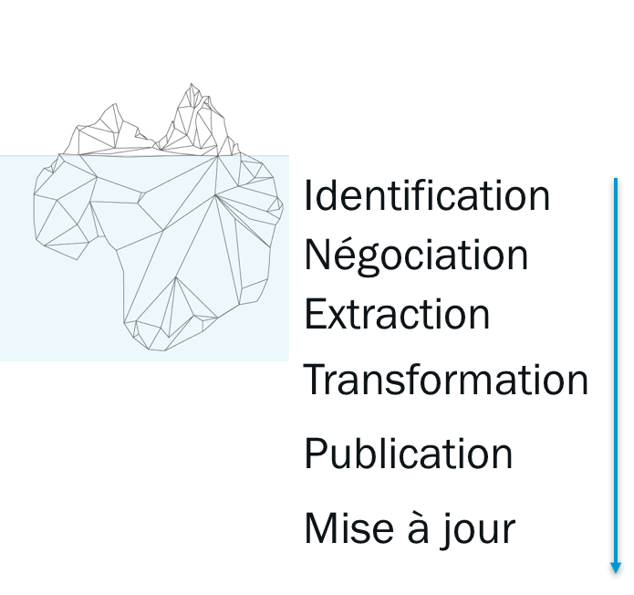
]
---
# Identification
.pull-left[
.reduite[
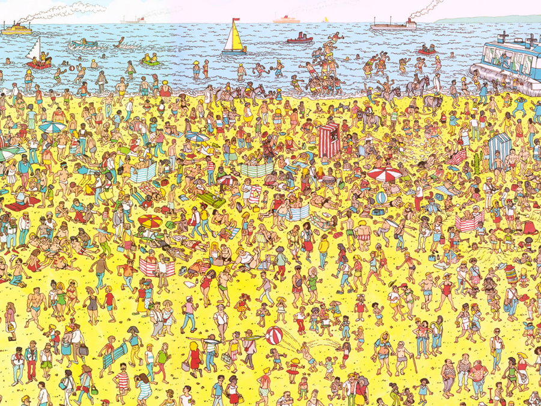
]]
.pull-right[

### Trouver les données

### Identifier leurs responsables

### Instaurer les données

]
---
# Négociation
.pull-left[
.reduite[

]]
.pull-right[

### Obtenir l’ouverture

### Contourner les « bonnes raisons organisationnelles » de ne pas ouvrir

]
---
# Extraction
.pull-left[
.reduite[

]]
.pull-right[

### Reconstituer les bases de données

### Construire des "moulinettes"

### Tenter d'automatiser l'ouverture
]
---
# Transformation
.pull-left[
.reduite[

]]
.pull-right[

### Editer les données

### Les standardiser

### Repenser la "qualité" des données
]
---
# Publication
.pull-left[
.reduite[
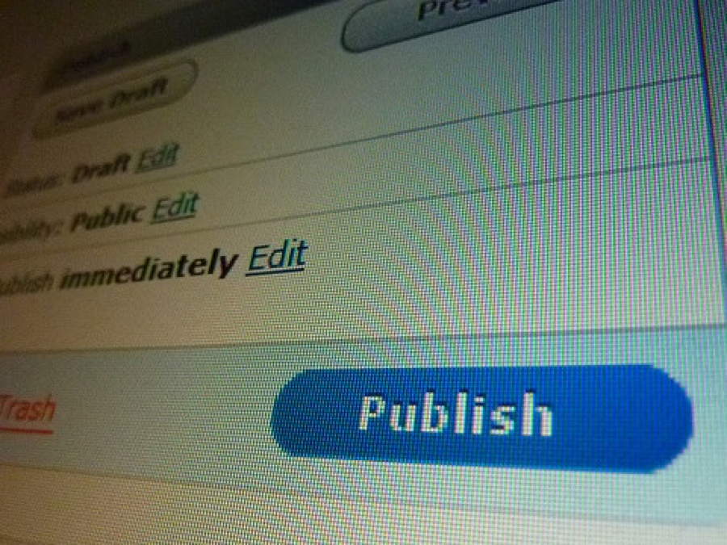
]]
.pull-right[

### Produire des métadonnées pour rendre intelligibles les données

### Retravailler les fichiers pour permettre l'exploration et la visualisation des données

]

---
# Mise à jour
.pull-left[

]
.pull-right[

### Relancer les producteurs de données 

### Prendre en compte les retours des usagers

### Automatiser l'ouverture
]
---
# Les limites de l’open data « de l’offre » pour l’administration

.pull-left[

]
.pull-right[

#### Un travail considérable qui est souvent sous-évalué

#### « Le boulot de personne » : rarement dans les missions des agents

#### Des projets tributaires des orientations politiques

####  Des publics de données parfois introuvables
]
---
# Les frictions et les déceptions des usagers
.pull-left[
[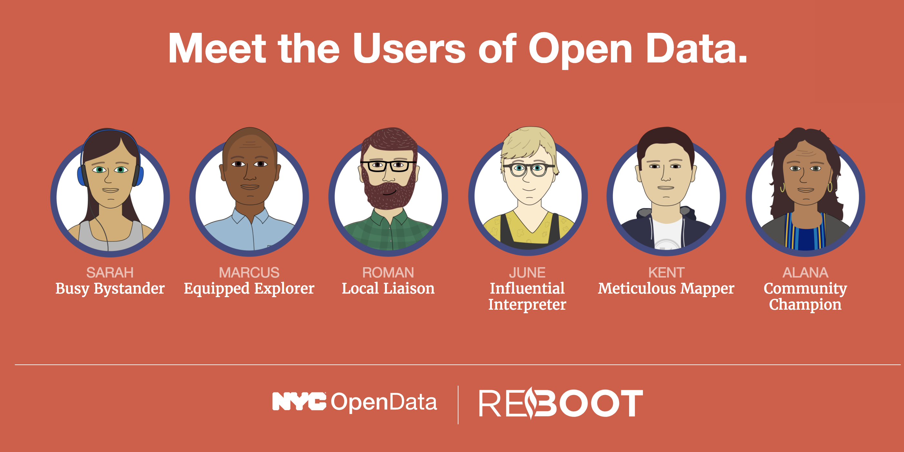](https://thereboot.github.io/moti-personas/)
]
.pull-right[
####  Des données difficiles à trouver, pas ouvertes partout

####  Granularité temporelle et spatiale souvent trop faible

####  Des données souvent inutilisables : manque de documentation

####  Des données pas mises à jour

####  Des portails qui ciblent les développeurs

]

---
# Open Data Barometer : le problème de la qualité
.pull-left[
>**Government data is usually incomplete, out of date, of low quality, and fragmented.** In most cases, open data catalogues or portals are manually fed as the result of informal data management approaches. **Procedures, timelines, and responsibilities are frequently unclear among government institutions tasked with this work.**
.footnote[http://opendatabarometer.org/4thedition/report/]
]
.pull-right[

]
---
#Open Data Index : des données bien cachées
.pull-left[
> Data findability is a major challenge. We have data portals and registries, but government agencies under one national government still publish data in different ways and different locations. Moreover, they have different protocols for license and formats(…)
**Data findability is a prerequisite for open data to fulfill its potential and currently most data is very hard to find.**
]
.pull-right[

.footnote[https://index.okfn.org/insights/]
]
---
class:inverse, middle, center
# Vers l'open data de la demande
---
# Ouverture des données et droit d’accès à l’information : des liens à tisser
.reduite[
[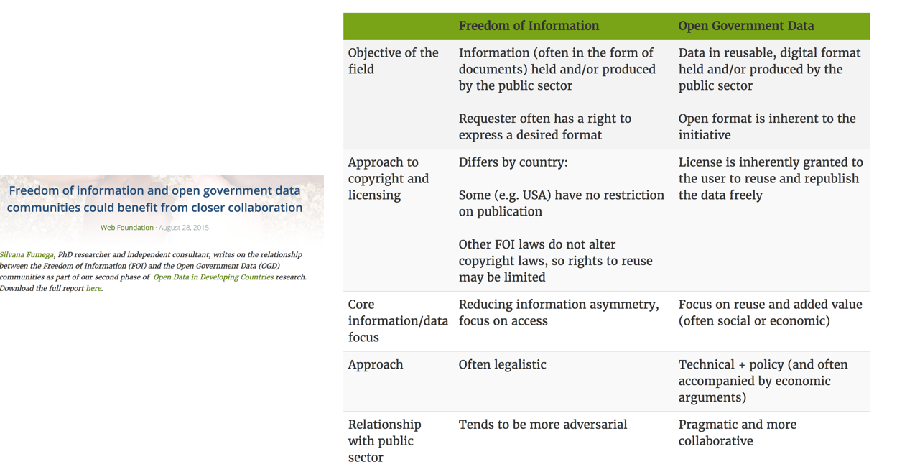](webfoundation.org/2015/08/freedom-of-information-and-open-government-data-communities-could-benefit-from-closer-collaboration/)
]
---
# Notre proposition : réveiller les données qui dorment
.pull-left[

]
.pull-right[
📣 Une plateforme qui permet de simplifier radicalement les Demandes d’Ouverture de Données (DODO)

📩 Des demandes précises, rédigées automatiquement pour des données sélectionnées

📥 Une plateforme qui facilite le traitement des demandes et guide les administrations dans l’ouverture de leurs données

]
---
## DODOdata : interroger les futurs usagers sur leurs besoins

.reduite[
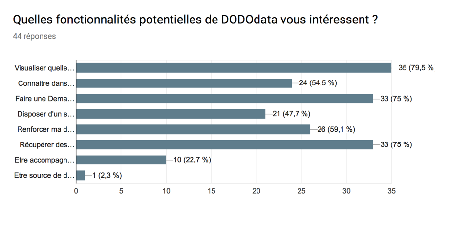
]

---
## DODOdata : un recensement des données en cours (publication fin 2017)
.reduite[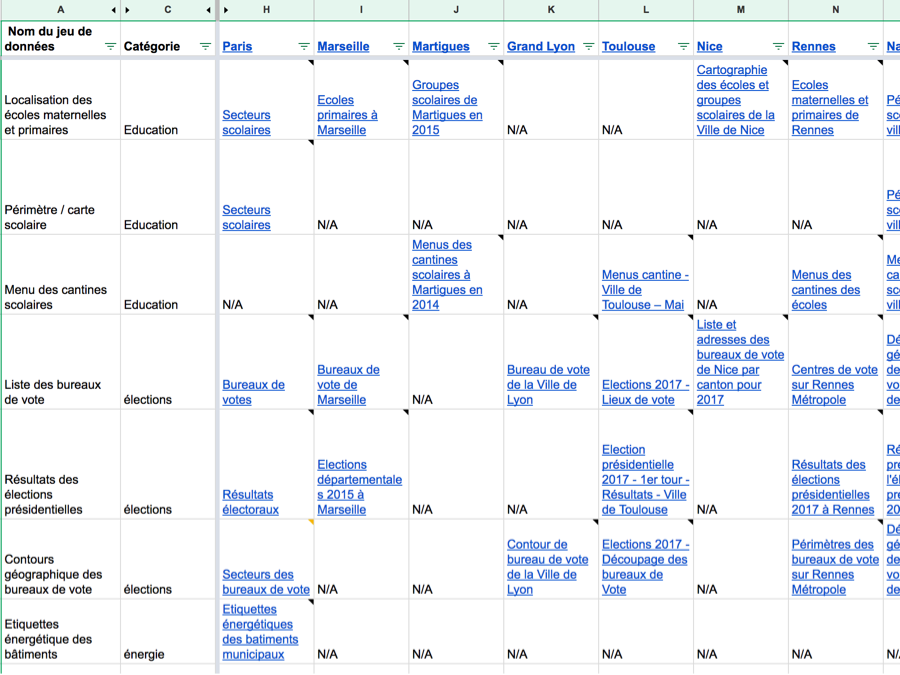]
---
class:inverse, middle, center
# Merci ! 

## Des questions ? 

.footnote[Vous pouvez me contacter à l'adresse samuel@datactivi.st]